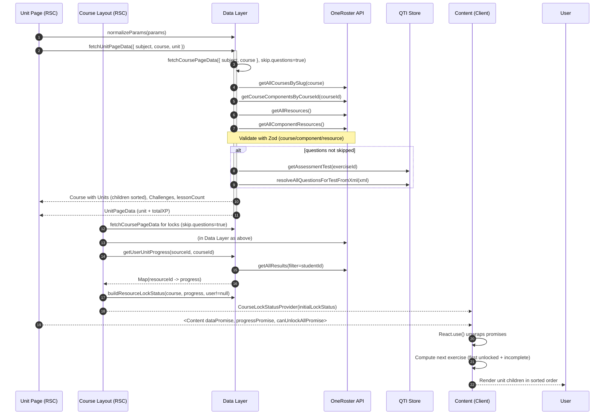

## Unit Overview Page Data Flow and Sorting

This document explains, end to end, how the Unit Overview page fetches, assembles, and sorts data, how user progress is computed and cached, and how locking/unlocking is determined. It traces all calls starting from the route `src/app/(user)/[subject]/[course]/(overview)/[unit]/page.tsx` through the data layer.

- Page component: `src/app/(user)/[subject]/[course]/(overview)/[unit]/page.tsx`
- Client content: `src/app/(user)/[subject]/[course]/(overview)/[unit]/components/content.tsx`
- Course-wide layout (provides locks): `src/app/(user)/[subject]/[course]/layout.tsx`
- Unit data fetcher: `src/lib/data/unit.ts`
- Course data assembler: `src/lib/data/course.ts`
- Progress aggregation: `src/lib/data/progress.ts`
- Clerk metadata schema: `src/lib/metadata/clerk.ts`
- Utilities (normalization, ordering, locks): `src/lib/utils.ts`

### 1) High-level responsibilities

- **Unit page (Server Component, non-async):**
  - Normalizes `params` to handle encoded characters
  - Initiates three promises in parallel:
    - `unitDataPromise`: Fetches `UnitPageData`
    - `userPromise`/`canUnlockAllPromise`: Reads Clerk public metadata and determines whether the user can force-unlock
    - `progressPromise`: Resolves in the course layout and is passed to `Content` via context
  - Streams UI using `<React.Suspense>` and passes promises to the client `Content` component.

- **Course layout (Server Component, non-async):**
  - Fetches course data (without questions) and current user
  - Computes the course-wide `resourceLockStatusPromise` using course structure + user progress
  - Provides `CourseLockStatusProvider` context to all children (including the Unit Overview page).

- **Client content:**
  - Uses `React.use()` to unwrap promises
  - Reads `resourceLockStatus` from context
  - Determines the next unlocked, incomplete exercise in the unit
  - Renders lessons, quizzes, and tests in the correct, pre-computed order.

### 2) Parameter normalization

- Function: `normalizeParams` in `src/lib/utils.ts`
- Purpose: Replace URL-encoded colons (`%3A`, `%3a`) to prevent cache duplication and ensure consistent slugs/IDs.
- Usage:
  - Page: `const normalizedParamsPromise = normalizeParams(params)`
  - Layout: same pattern for course-level params.

### 3) Unit data assembly (`fetchUnitPageData`)

- File: `src/lib/data/unit.ts`
- Inputs: `{ subject, course, unit }` (normalized)
- Steps:
  1. Assert no encoded colons in `unit`.
  2. Call `fetchCoursePageData({ subject, course }, { skip: { questions: true } })` to assemble the entire course structure without question lookups (for performance on overview paths).
  3. Locate the unit by slug: `course.units.find((u) => u.slug === params.unit)`.
  4. Compute `totalXP` for the unit:
     - Sum XP of all lesson children (videos, articles, exercises)
     - Plus XP for unit-level assessments (quizzes, unit tests)
  5. Return `UnitPageData` containing: `params`, full `course`, `allUnits`, the specific `unit`, `lessonCount` (from course), `challenges` (course challenges), and `totalXP` (unit).

There are no database joins here; instead, relationships are resolved from OneRoster and QTI data at the course level (see next section), and `fetchUnitPageData` selects the targeted unit and aggregates its XP.

### 4) Course data assembly and sorting (`fetchCoursePageData`)

- File: `src/lib/data/course.ts`
- External data sources:
  - OneRoster fetchers (`src/lib/data/fetchers/oneroster`):
    - `getAllCoursesBySlug(slug)`
    - `getCourseComponentsByCourseId(courseId)`
    - `getAllResources()`
    - `getAllComponentResources()`
  - QTI fetchers and resolution:
    - `getAssessmentTest(resourceId)` → QTI XML
    - `resolveAllQuestionsForTestFromXml(xml)` → list of question identifiers

- Validation:
  - Every payload is validated with Zod schemas:
    - `CourseMetadataSchema`
    - `ComponentMetadataSchema`
    - `ResourceMetadataSchema`
  - Failure paths log via `@superbuilders/slog` and throw via `@superbuilders/errors`.

- Construction flow:
  1. Identify course by slug; validate `course.metadata`.
  2. Fetch all Components for the course.
     - Components without `parent` are Units
     - Components with `parent` are Lessons (or other child components)
  3. Sort Units by `component.sortOrder` and map to internal `Unit` shape with `ordering`.
  4. Fetch and filter Resources to only those referenced by this course’s ComponentResources.
  5. Map Resources to their owning Component via `resourcesByComponentSourcedId`.
  6. Determine Exercises early (by `ResourceMetadataSchema.khanActivityType === "Exercise"`).
  7. If not skipping questions:
     - For each Exercise, fetch QTI test XML and resolve question identifiers
     - Populate a `questionsMap` keyed by exercise sourcedId with question counts
     - If skipping, default to 5 questions per exercise (configurable default) to keep shapes consistent
  8. Build per-Unit children:
     - For each Unit:
       - Create `unitAssessments` from Resources with type `Quiz` or `UnitTest`, using `componentResource.sortOrder` for ordering
       - Build Lessons:
         - For each Lesson Component, collect its Resources and construct typed children:
           - Videos, Articles, Exercises
           - Each child gets `ordering` from `componentResource.sortOrder`
           - Exercises compute `totalQuestions` (min(4, questionBankSize)) and `questionsToPass` (totalQuestions - 1)
         - Sort each lesson’s children by `sortOrder`
       - Merge Lessons and Assessments into a unified list of Unit children with a single `ordering` field derived from `sortOrder`
       - Final sort for the Unit’s `children` by `ordering`
  9. Compute `lessonCount` across Units.
  10. Detect Course Challenge component and build `challenges`, sorted by associated component resource `sortOrder`.
  11. Compute `totalXP` for the course (sum of all unit children XP + challenges XP).

- Sorting guarantees and provenance:
  - Unit order: `unit.ordering` (from Component.sortOrder)
  - Within a Unit: a single sorted sequence of children where each item’s `ordering` is propagated from either
    - Lesson Component.sortOrder (for Lessons), or
    - ComponentResource.sortOrder (for assessments: Quiz, UnitTest)
  - Within a Lesson: children (Video, Article, Exercise) sorted by ComponentResource.sortOrder
  - Course Challenges: sorted by their component resource `sortOrder`, appear at the end

There are no AI calls in this path. QTI XML resolution is deterministic parsing; it is not LLM-powered.

### 5) Progress aggregation and caching (`getUserUnitProgress`)

- File: `src/lib/data/progress.ts`
- Inputs: `userId` (OneRoster sourcedId), `onerosterCourseSourcedId` (course ID)
- Caching: Wrapped in `redisCache` with key `['user-progress', userId, courseId]` and `revalidate: 3600` seconds (1 hour). The cached value is an array of `[resourceId, progress]` entries rehydrated into a `Map`.
- Source data: OneRoster Results API via `oneroster.getAllResults({ filter: "student.sourcedId='<userId>'" })`
- Filtering and selection:
  - Only consider results whose `assessmentLineItem.sourcedId` ends with `_ali` (new alias format)
  - Validate result IDs using `isInteractiveAttemptResult` / `isPassiveContentResult`
  - Derive `resourceId` from the line item via `getResourceIdFromLineItem`
  - For each `resourceId`, keep only the latest result by `scoreDate`
- Progress mapping rules:
  - fully graded + numeric score → `completed: true`, `score: round(score)`, `proficiency: attempted|familiar|proficient`
    - `>= 100` → `proficient`
    - `>= 70` → `familiar`
    - else → `attempted`
  - partially graded + numeric score → `completed: false`, `score`
  - fully graded without numeric score → `completed: true`

Output: `Map<string, AssessmentProgress>` keyed by `resourceId` (covers exercises, quizzes, unit tests, videos, and articles depending on returned results).

### 6) Locking and unlocking

- Provider: `src/app/(user)/[subject]/[course]/components/course-lock-status-provider.tsx`
- Created and populated in layout: `src/app/(user)/[subject]/[course]/layout.tsx`
- Initial lock computation: `buildResourceLockStatus(course, progressMap, lockingEnabled)` in `src/lib/utils.ts`:
  - Determines a course-wide linearized ordering via `getOrderedCourseResources(course)`
    - Units sorted by `unit.ordering`
    - Unit children sorted by `ordering`
    - Lesson children sorted by `ordering`
    - Challenges appended at the end
  - Walks the ordered list and sets a resource as locked if the previous resource is incomplete AND this resource itself is not completed
  - Completion rule:
    - Assessments (Exercise, Quiz, UnitTest, CourseChallenge): require `score >= XP_PROFICIENCY_THRESHOLD` (80) to count as complete
    - Non-assessment content (Video, Article): require `progress.completed === true`
  - `lockingEnabled` is `true` for authenticated users; `false` otherwise (guests see everything unlocked, but progress remains empty)

- Unlock all toggle:
  - Eligibility: `canUnlockAll` computed from Clerk metadata → user has any role other than `student`
  - Persistence: localStorage key `nice_unlock_all_<courseId>`; when present, the provider sets all locks to `false` on hydration
  - The Unit `Content` component exposes a button to toggle unlock-all when `canUnlockAll` is true.

### 7) Client rendering and next exercise selection

- File: `src/app/(user)/[subject]/[course]/(overview)/[unit]/components/content.tsx`
- Promises consumed with `React.use()`:
  - `dataPromise: Promise<UnitPageData>` (includes the fully sorted `unit.children`)
  - `progressPromise: Promise<Map<string, AssessmentProgress>>`
  - `canUnlockAllPromise: Promise<boolean>`
- Next exercise algorithm:
  - Flatten all exercises in the unit in their already-computed order
  - Pick the first one where `resourceLockStatus[id] !== true` AND `progressMap.get(id)?.completed !== true`
  - This drives CTA placement and navigation affordances.

### 8) Error handling and logging

- All external operations use `@superbuilders/errors` (`errors.try`, `errors.wrap`) and structured logging via `@superbuilders/slog`.
- Validation failures, missing relationships, or invariant breaks are logged with structured context and then thrown (no silent fallbacks).

### 9) Sequence overview (Mermaid)

### 10) What’s “sorted” where?

- Units: sorted ascending by `component.sortOrder` and exposed as `unit.ordering`.
- Unit children: a single list sorted ascending by `ordering` (propagated from `sortOrder`).
- Lesson children: sorted ascending by `componentResource.sortOrder`.
- Course challenges: sorted ascending by `componentResource.sortOrder`, appended at end of course resources.

### 11) Notes on data shape stability

- Sorting is performed in the data layer to guarantee a single authoritative order for all consumers (overview pages, practice routes, locking logic).
- The `ordering` field is propagated into domain objects to avoid recomputing or inferring order later in the UI.
- Progress and locking are decoupled from ordering: the order is stable regardless of user progress; locking reads progress and applies sequential rules over that fixed order.

### 12) AI usage

- There are no LLM/AI calls in this route’s data path. QTI parsing uses deterministic XML resolution only. Any AI utilities in `src/lib/ai` are unrelated to this flow.

